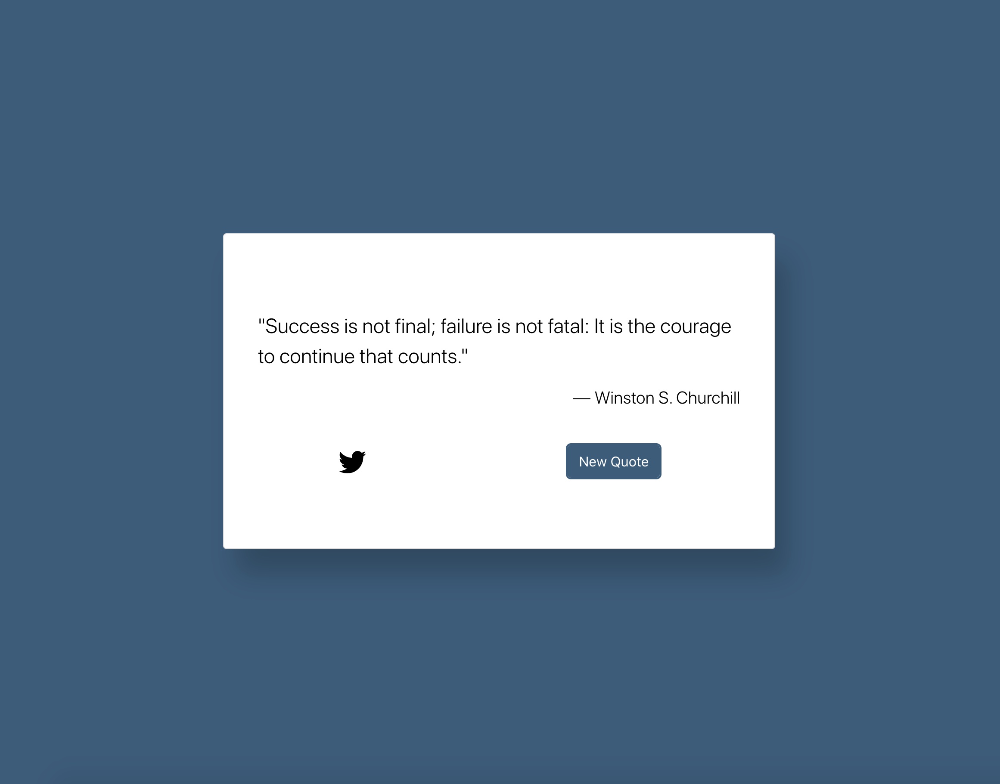
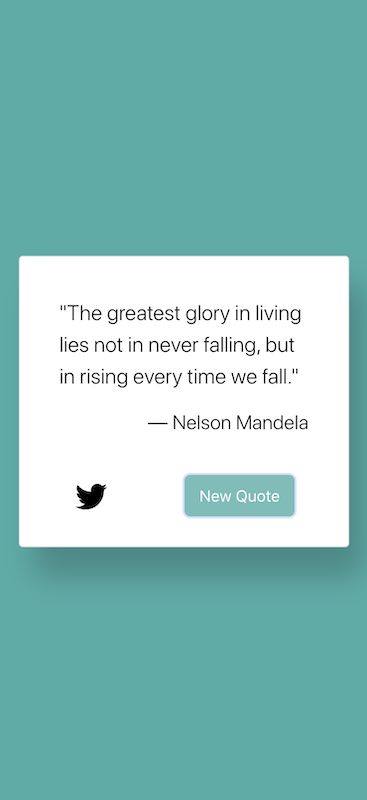

# Quote Generator

## Overview

A web application that utilizes modern front-end frameworks and displays random inspirational quotes.

## Description

This project incorporates utilizes Bootstrap and React to create a positive user experience. The page's styling and content is dynamically updated based on state. I particularly enjoyed the logic that went into ensuring that every time the "New Quote" button gets clicked, there is a unique color change and unique quote that is displayed next. Because I only placed a few colors and quotes into the code initially, I was running into an issue where sometimes selecting a random color/quote would result in the same color/quote being selected twice in a row. I'm glad I was able to solve that issue because that would have hindered the user experience.

In creating this project, I also learned more about creating realistic drop shadows with CSS. I found an excellent article online that went into the theory behind what makes a shadow realistic and offered suggestions for keeping a proper ratio in a CSS shadow: https://www.joshwcomeau.com/css/designing-shadows/

Additionally, I was able to learn how to use React on CodePen. I built the page in Visual Studio Code and periodically pushed updates to GitHub, but translating the finished product into something that would also work well on CodePen and that could be tested was a challenge. After some research, I learned about how to successfully import various CDNs so that components can display as expected.

Overall, this was a great opportunity for me to further develop my skills in using React. This page could certainly be further developed with even more colors, quotes, and perhaps animations as well.

## Technologies Used

- HTML
- CSS
- Bootstrap
- JavaScript & JSX
- React

## Installation

No installation steps are required to view this project. The application's source code can be found on GitHub here: https://github.com/vruss14/quote-generator.

## Usage

The webpage includes responsive design and can be viewed successfully on all devices.

Below is a screenshot of the desktop version of the page:

Below is a screenshot of the page on mobile:

## Credits

Valerie Russell was the sole contributor to this project. Contact her at vruss14@gmail.com.